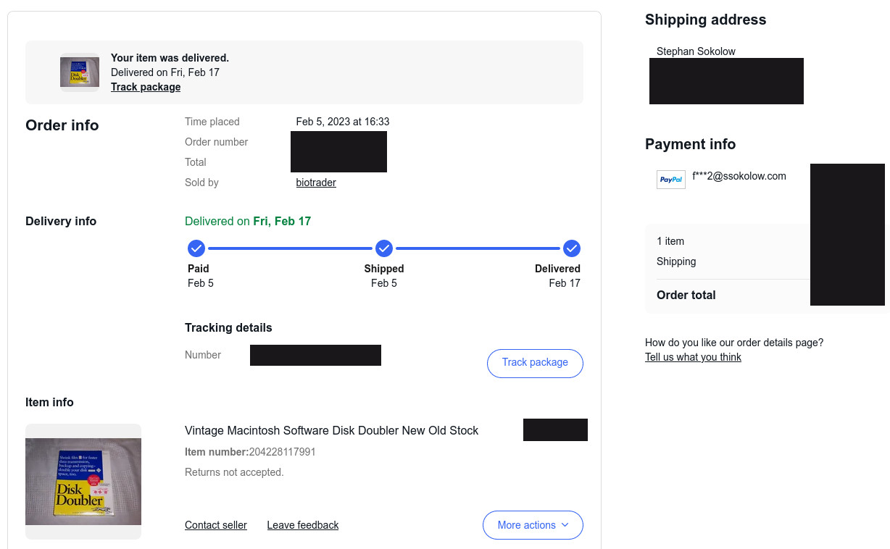
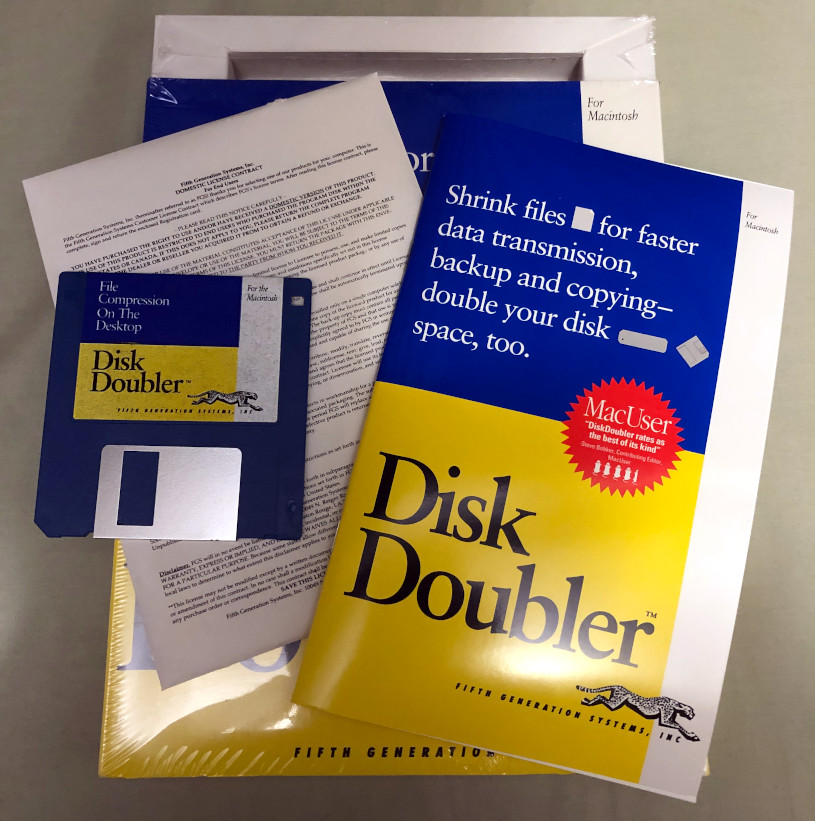
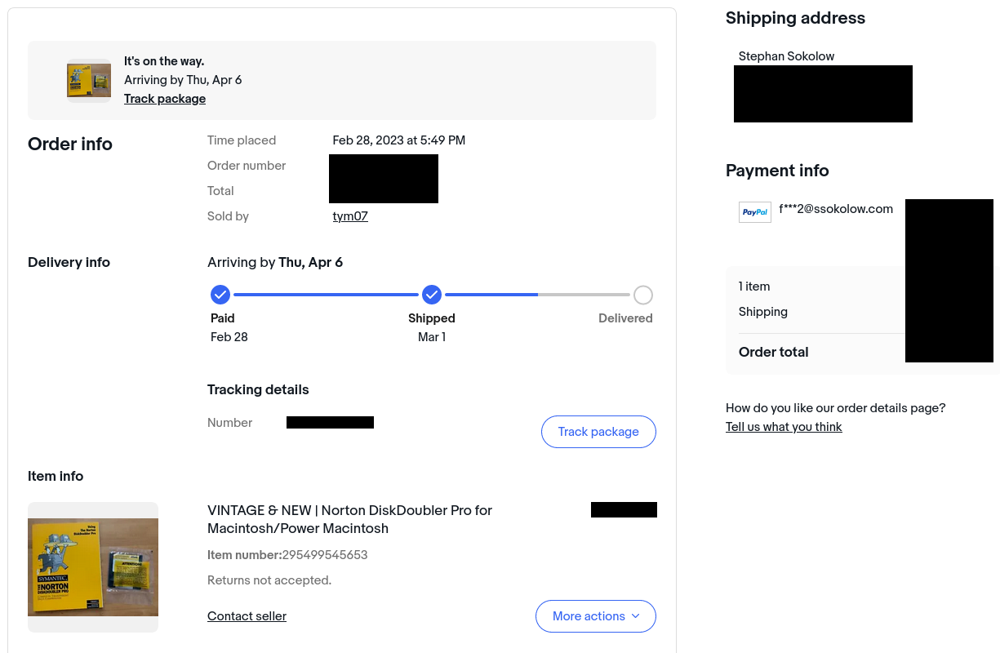
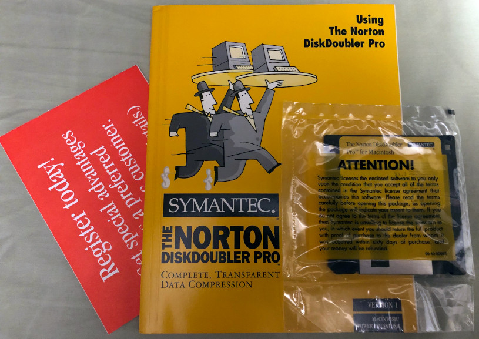
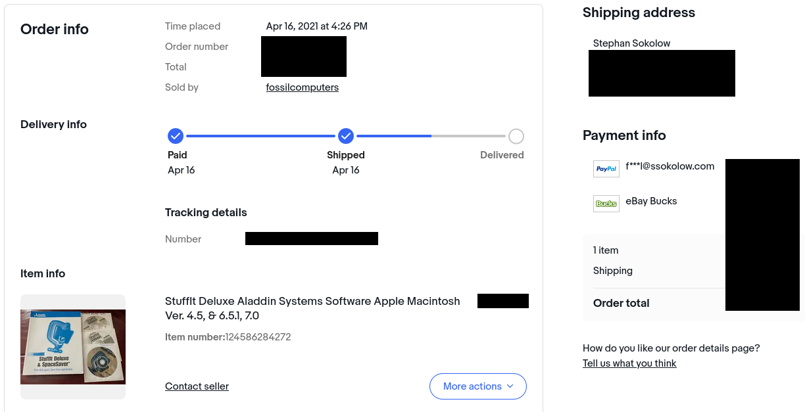
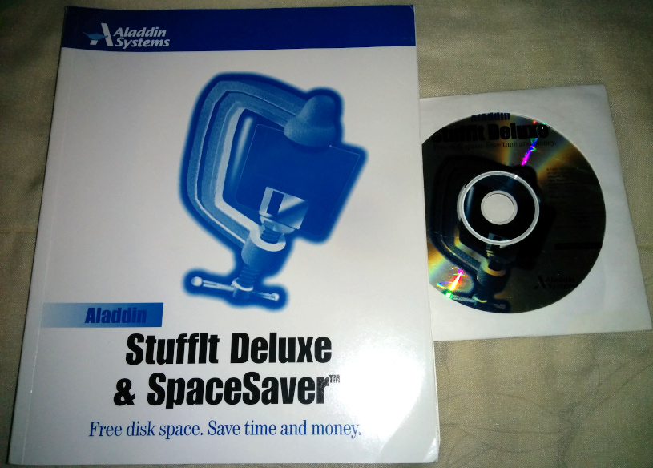
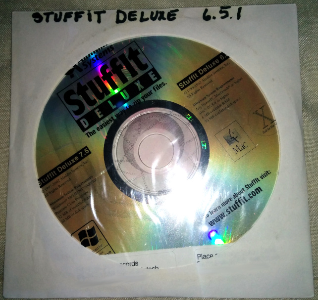
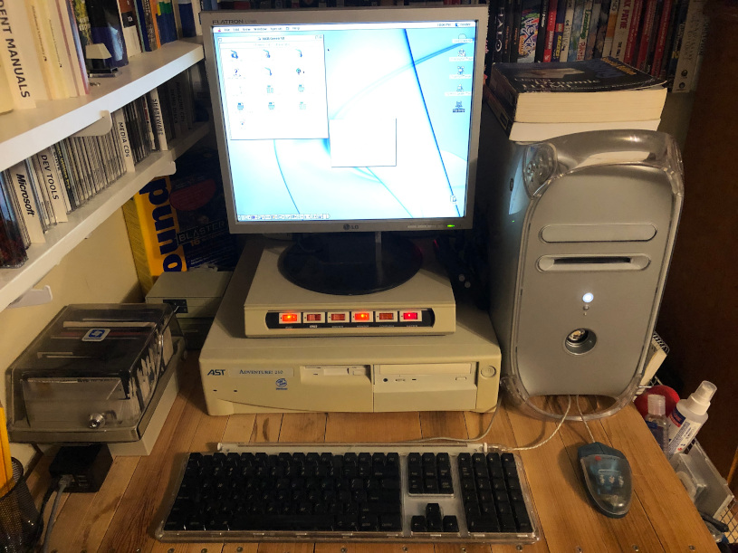

# DiskDoubler Test Files

This repository contains a collection of minimal, legally redistributable
DiskDoubler archives suitable for inclusion in test suites for programs that
incorporate DiskDoubler extraction functionality.

**See Also:**
[StuffIt Test Files](https://github.com/ssokolow/stuffit-test-files/),
[RAR Test Files](https://github.com/ssokolow/rar-test-files)

## Explain

Since there are no free tools I know of for creating
[DiskDoubler](https://en.wikipedia.org/wiki/DiskDoubler) archives, and it's
important to be able to integration-test systems that use `lsar` and `unar` from
The Unarchiver's open-source
[command-line tools](https://theunarchiver.com/command-line) to process legacy
archives, I decided to step up and create some legally redistributable
DiskDoubler archives.

## Contents

The loose files are DiskDoubler-compressed data forks, as should be extractable
using a non-Macintosh tool such as the The Unarchiver's CLI tools, though this
only appears to be true for DiskDoubler 3.7.7, with The Unarchiver CLI tools
v1.10.1 being very hit-or-miss about supporting DiskDoubler Pro 4.1.1's formats
no matter how they're packaged.

(Confirmed to be the fault of The Unarchiver CLI tools because it says the
container checksum for the BinHex-encoded ones is correct but then says the
contained archive is corrupt, while copying it back to my mac and unpacking it
there using the official code works flawlessly.)

The `.dd` files are archives created using DiskDoubler 3.7.7's "Combine" option
or DiskDoubler Pro 4.1.1's "Create Archive" option and are created directly from
the uncompressed source files, not from the DiskDoubler-compressed individual
files.

Files ending in `.1` and `.2` are copies of the files with the same names minus
the numeric extension, split into pieces using DiskDoubler's apparently
proprietary "Split" option which The Unarchiver CLI tools v1.10.1 can't make
heads or tails of either directly or when manually `cat`ed together.

The StuffIt archives are complete (data fork, resource fork, HFS creator and
type codes) representations of the individually DiskDoubler-compressed files in
the following formats, compressed using the copy of StuffIt Deluxe 4.5 (for
DiskDoubler 3.7.7) or 6.5.1 (for DiskDoubler Pro 4.1.1) which I purchased for my
[StuffIt Test Files](https://github.com/ssokolow/stuffit-test-files/) repository
and confirmed to be extractable using The Unarchiver's CLI tools as built from
source for the Ubuntu Linux 20.04 LTS package repository.

The meaning of the shorthand in folder and archive names is as follows:

- `dd377.ad`: DiskDoubler 3.7.7, AutoDoubler A compression
- `dd377.ads`: DiskDoubler 3.7.7, AutoDoubler B compression
- `dd377.dda`: DiskDoubler 3.7.7, DiskDoubler A compression
- `dd377.ddb`: DiskDoubler 3.7.7, DiskDoubler B compression
- `ddpro41.ad1`: DiskDoubler Pro 4.1.1, AD1 compression
- `ddpro41.ad2`: DiskDoubler Pro 4.1.1, AD2 compression
- `ddpro41.dd1`: DiskDoubler Pro 4.1.1, DD1 compression
- `ddpro41.dd2`: DiskDoubler Pro 4.1.1, DD2 compression
- `ddpro41.dd3`: DiskDoubler Pro 4.1.1, DD3 compression
- `.prompt.sea`: Same as a `.sea` file (self-extracting archive), but configured
  to prompt for where to extract the files.

The source files are the same public domain ones created for my StuffIt Test
Files repository, with a fresh set being extracted from `sources.sit` on my
Power Mac G4 for each variant of DiskDoubler compression.

## "How Do I Know These Are Legal?"

First, the contents are the same test files I created from scratch and released
into the public domain for my
[RAR test files](https://github.com/ssokolow/rar-test-files) and
[StuffIt Test Files](https://github.com/ssokolow/stuffit-test-files/)
repositories, plus a TIFF file converted from the PNG file using a copy of
GraphicConverter 5.9.5 for Classic MacOS that has been registered using a
license key
[now given away for free](https://www.lemkesoft.de/en/products/graphicconverter/download/download-old-versions/)
by the original developer.

- My copy of DiskDoubler 3.7.7 was purchased as sealed New Old Stock on eBay.
- My copy of DiskDoubler Pro 4.1.1 (or v1.1 as the print on the floppy label
  calls it) had been removed from its box but, aside from that, was complete and
  the perforated "by opening this, you accept the license" bag around the floppy
  was unopened.
- The used copy of StuffIt Deluxe 4.5 on the drive I installed DiskDoubler 3.7.7
  to was purchased on eBay and has a passage in its license that allows for the
  transfer of the license:

  > 3. OTHER RESTRICTIONS. You may not rent or lease the SOFTWARE, but **you may
  >    transfer the SOFTWARE and accompanying written materials on a permanent
  >    basis provided you retain no copies and the recipient agrees to the terms
  >    of this agreement**. [...]

- The used copy of StuffIt Deluxe 6.5.1 on the drive I installed DiskDoubler Pro
  4.1.1 onto (and used for BinHexing the DiskDoubler 3.7.7 files) doesn't
  _explicitly_ say the license is transferable, but doesn't say anything to the
  contrary and it should be implicit in the passage I've bolded here:

  > The Software is owned by Aladdin Systems and is protected by United States
  > copyright laws and international treaty provisions. **Therefore, you must
  > treat the Software like any other copyrighted material (e.g., a book or
  > musical recording).** Paying the license fee allows you the right to use one
  > copy of the Software on a single computer. You may not network the Software
  > or otherwise use it or make it available for use on more than one computer
  > at the same time. You may not rent or lease the Software, nor may you
  > modify, adapt, translate, reverse engineer, decompile, or disassemble the
  > Software. If you violate any part of this agreement, your right to use this
  > Software terminates automatically and you must then destroy all copies of
  > the Software in your possession.

All are running on a genuine Power Mac G4 Quicksilver 2002 which I own:

(Yeah. eBay's international tracking can be flaky on the destination leg of the
journey.)

---

## Future Plans

- The option to create a self-extracting archive with DiskDoubler 3.7.7 seems to
  only be available via the INIT which crashes Finder under MacOS 9. Revisit
  this when I have a Macintosh capable of running System 6 or 7.
- Keep an eye out for any older copies of DiskDoubler which implement the "Old
  B" compression listed in DiskDoubler 3.7.7's Convert dialog and, while I'm
  _very_ skeptical that I'll ever see one, let alone at a price I can afford,
  there's also a greyed out "Sigma" compression which apparently had something
  to do with the
  [DoubleUp](https://archive.org/details/TNM_DiskDoubler_data_compression_card_for_Macinto_20171214_0204)
  NuBus hardware accelerator.

## License

By design, the files within the archives have been created from scratch and are
minimally novel in the hope that they will be ineligible for copyright.

I hereby release anything in these archives that I _do_ hold copyright to into
the public domain using the Creative Commons
[CC0](http://creativecommons.org/publicdomain/zero/1.0/) public domain
dedication.

  
   
  To the extent possible under law,
  
    Stephan Sokolow
  has waived all copyright and related or neighboring rights to
  DiskDoubler Test Files.
This work is published from:

  Canada.

